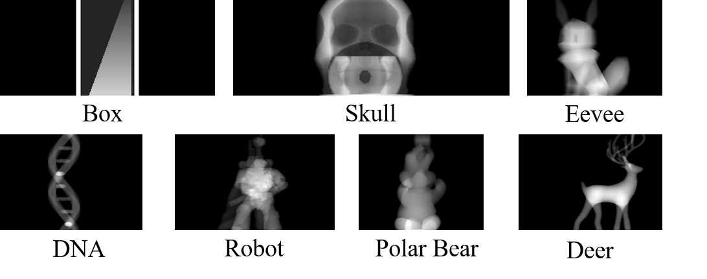
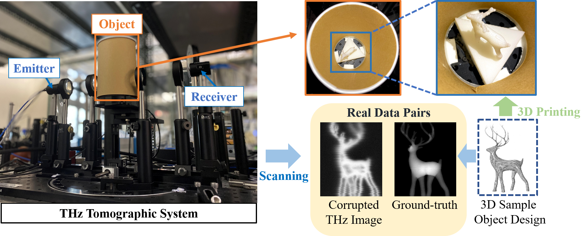

# THz-TDS Image Dataset
The THz-TDS Image Dataset provides THz angle-spatio-spectral data, available from this page, include 7 sample objects, and each object has 60 views. 



## Download
**Dataset are available as below:**

[https://drive.google.com/file/d/1FqxHWqjZOZme_pzE7Nx9osHlDV4FOyXb/view?usp=sharing](https://drive.google.com/file/d/1fVY5sUPltpD_bsOt1np9bcDUnhsDTxsc/view?usp=sharing)

### The dataset include 4 files:

**Gt:** the Ground-truth image.

**Time:** the time domain signal.

**Amp:** the amplitude components from frequency domain.

**Phase:** the phase components from frequency domain.


### The data folder is structured as follows:

    dataset
        ├────── Gt
        │       ├── deer
        │       │     ├── 0.npy
        |       |     |    :
        │       │     └── 59.npy
        │       ├── eevee
        │       ├── box
        │       ├── dna
        │       ├── robot
        │       ├── polarbear
        │       └── skull
        └── Time
        └── Amp
        └── Phase


## About Dataset
The measurement of sample objects by a Printech 3D printer, and use the material of high impact polystyrene (HIPS) for 3D-printing the objects
due to its high penetration of THz waves. We then use our in-house ASOPS THz-TDS system. 
Each sample object is placed on a motorized stage between the source and the receiver. 
With the help of the motorized stage, raster scans are performed on each object in multiple view angles. 
In the scanning phase, we scan the objects covering a rotational range of 180 degrees (step-size: 6 degrees),  a horizontal range of 72mm (step-size: 0.25mm), and a variable vertical range corresponding to the object height (step-size: 0.25mm). 
In this way, we obtain 30 projections of each object, which are then augmented to 60 projections by horizontal flipping. The ground-truths of individual projections are obtained by converting the original 3D printing files into image projections in every view-angle. We use markers to indicate the center of rotation so that we can align the ground-truths with the measured THz data. In this paper, totally 7 objects are printed, measured, and aligned for evaluation. 



## License and Citation
All datasets and benchmarks on this page are copyright by us and published under the [Creative Commons Attribution-NonCommercial-ShareAlike 3.0 License](http://creativecommons.org/licenses/by-nc-sa/3.0/). This means that you must attribute the work in the manner specified by the authors, you may not use this work for commercial purposes and if you alter, transform, or build upon this work, you may distribute the resulting work only under the same license.

```
@inproceedings{hung2019terahertz,
  title={Terahertz deep learning computed tomography},
  author={Hung, Yi-Chun and Yang, Shang-Hua},
  booktitle={2019 44th international conference on infrared, millimeter, and terahertz waves (IRMMW-THz)},
  pages={1--2},
  year={2019},
  organization={IEEE}
}

@article{su2021seeing,
  title={Seeing through a black box: Toward high-quality terahertz tomographicimaging via multi-scale spatio-spectral image fusion},
  author={Su, Weng-tai and Chao, Ta-Hsuan and Yang, Shang-Hua and Lin, Chia-Wen},
  journal={arXiv preprint arXiv:2103.16932},
  year={2021}
}
```
